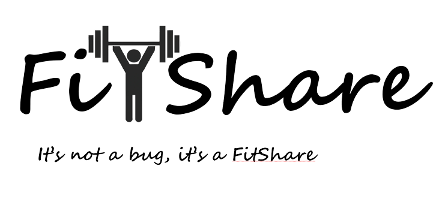

<div align="center">
  
</div>

# FitShare
Welcome to FitShare - Your Fitness Companion 🏋️‍♀️🏃‍♂️

FitShare is a cutting-edge social-networking platform designed to help people achieve their fitness goals and improve their overall health. Whether you're a seasoned athlete or just starting out on your fitness journey, FitShare offers a collaborative and supportive environment where you can share your training program, track your workouts and get the knowledge you need to build your next training program and reach your goals.

# Team members
* [Meitar Rizner](https://github.com/MeitarRizner)
* [Amit Finzi](https://github.com/finziamit)

# Getting started

In order to run **FitShare** you should install:

- [Vagrant](https://www.vagrantup.com/downloads)
- [VirtualBox](https://www.virtualbox.org/) hypervisor(VMM)

### Run The Project

1. Clone [FitShare](https://github.com/finziamit/FitShare.git) repository.
  ``` git clone https://github.com/finziamit/FitShare.git ```
2. Navigate via terminal to the cloned directory.
3. Run the 'vagrant up' command
4. Use any browser and navigate to http://localhost:8000.
5. Get ready to take your fitness journey to the next level with FitShare! 💪🔥
